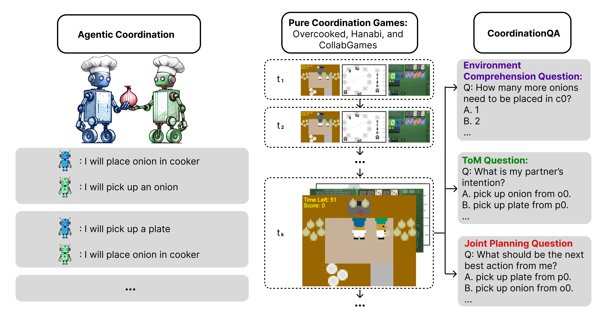

<h1>
   LLM-Coordination
</h1>

Authors: [Saaket Agashe](https://saa1605.github.io/), [Yue Fan](http://www.yfan.site/), [Anthony Reyna](), [Xin Eric Wang](https://eric-xw.github.io/) 

University of California, Santa Cruz

Code repository for the paper "LLM-Coordination: Evaluating and Analyzing Multi-agent Coordination Abilities in Large Language Models"



The emergent reasoning and Theory of Mind (ToM) abilities demonstrated by Large Language Models (LLMs) make them promising candidates for developing coordination agents. In this study, we introduce a new LLM-Coordination Benchmark, aimed at a detailed analysis of LLMs within the context of Pure Coordination Games, where participating agents need to cooperate for the most gain. This benchmark evaluates LLMs through two distinct tasks: (1) Agentic Coordination, where LLMs act as proactive participants for cooperation in 4 pure cordination games; (2) Coordination Question Answering (QA), where LLMs are prompted to answer 198 multiple-choice questions from the 4 games for evaluation of three key reasoning abilities: Environment Comprehension, ToM Reasoning, and Joint Planning. Furthermore, to enable LLMs for multi-agent coordination, we introduce a Cognitive Architecture for Coordination (CAC) framework that can easily integrate different LLMs as plug-and-play modules for pure coordination games. Our findings indicate that LLM agents equipped with GPT-4-turbo achieve comparable performance to state-of-the-art reinforcement learning methods in games that require commonsense actions based on the environment. Besides, zero-shot coordination experiments reveal that, unlike RL methods, LLM agents are robust to new unseen partners. However, results on Coordination QA show a large room for improvement in the Theory of Mind reasoning and joint planning abilities of LLMs. The analysis also sheds light on how the ability of LLMs to understand their environment and their partner's beliefs and intentions plays a part in their ability to plan for coordination.

## Setup
```
conda create -n llm_coordination python=3.9
conda activate llm_coordination
```

Clone the repository 
```
git clone https://github.com/eric-ai-lab/llm_coordination.git
cd llm_coordination
```

Install requirements
```
pip install -r requirements.txt
```

Build from source
```
pip install -e .
```


## Usage
Agentic Evals scripts are located under 'src/agentic_evals/' 

Run Overcooked Evals
```
cd src/agentic_evals
python GAME_NAME_agent_benchmarking.py --model_name YOUR_MODEL_NAME
```

GAME_NAME can be ['hanabi', 'overcooked', 'collab_capture', 'collab_escape']

For both evals if using an offline LLM like Mixtral, please install vLLM and follow the [instructions](https://docs.vllm.ai/en/latest/serving/openai_compatible_server.html) to run the API server. 

## Other Repositories used: 
The Overcooked environment: https://github.com/HumanCompatibleAI/overcooked_ai/tree/master

Hanabi Learning Environment: https://github.com/google-deepmind/hanabi-learning-environment

Hanabi Bot: https://github.com/Zamiell/hanabi-bot

API-style LLM Calls: https://github.com/vllm-project/vllm


## Citation
```
@misc{agashe2023evaluating,
      title={Evaluating Multi-Agent Coordination Abilities in Large Language Models}, 
      author={Saaket Agashe and Yue Fan and Anthony Reyna and Xin Eric Wang},
      year={2023},
      eprint={2310.03903},
      archivePrefix={arXiv},
      primaryClass={cs.CL}
}
```